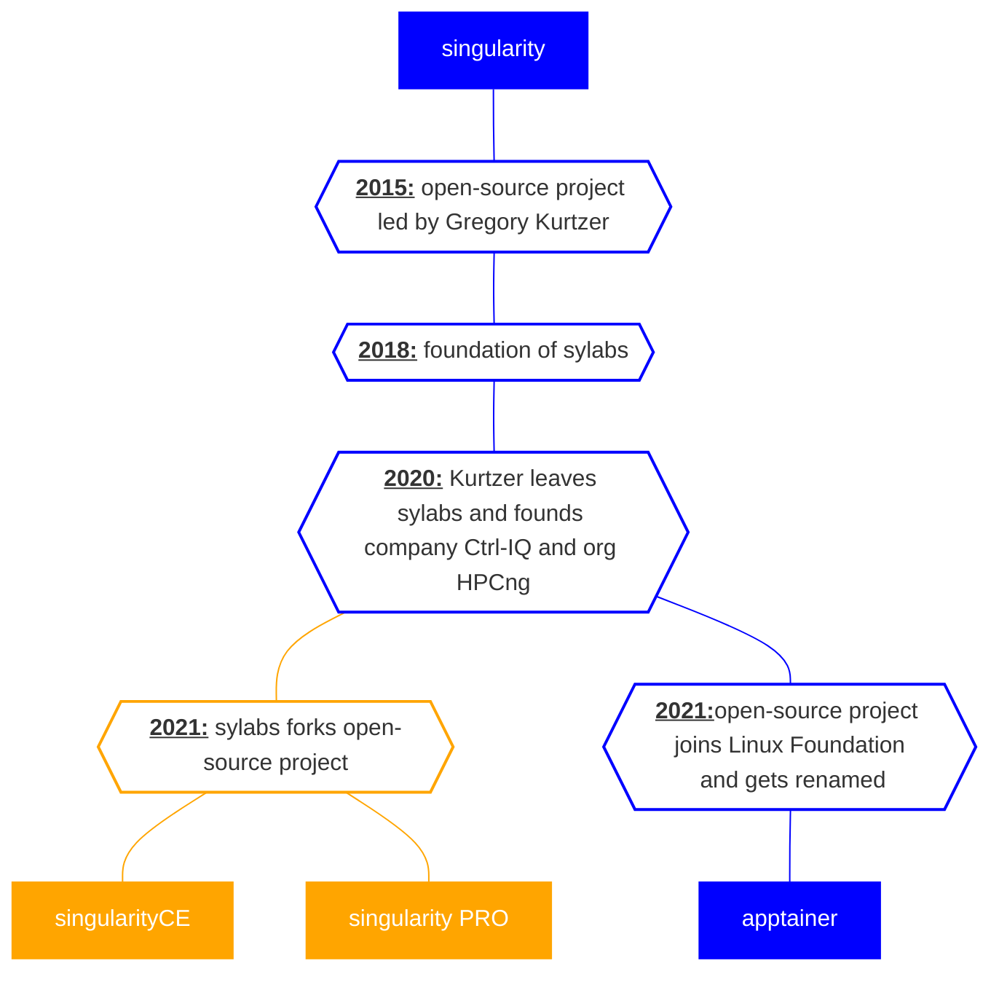
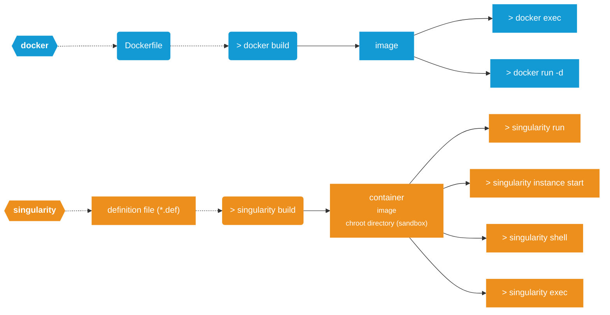

# Singularity / Apptainer
## Is a container just a small VM?
Containers and virtual machines (VMs) serve the purpose of isolating applications for running, but they function at different levels of abstraction and possess unique features. Unlike containers, VMs mimic the entire hardware setup, encompassing the operating system. In contrast, containers utilize the host operating system's kernel and merely package the application and its prerequisites.

This fundamental distinction leads to divergent resource usage, portability, and scalability. Containers generally have lower resource overhead compared to VMs, as they don't need to mimic an entire operating system. Moreover, containers are easier to move between environments due to their lightweight nature. However, containers may face compatibility issues when transitioning between different host environments because they rely on the same kernel.

Containers, particularly Docker and Singularity, emphasize the concept of immutability. This means the containerized environment stays consistent and reliable across multiple deployments and environments. By maintaining a fixed state, it simplifies the management and deployment process, making it more predictable and efficient.


This document is dedicated to the basics of building and using singularity images with singularity CE/apptainer.


### A brief history of the open-source projects:


Some more details can be found in [these slides](https://indico.cern.ch/event/1096030/contributions/4845037/attachments/2441579/4182748/GDBSingularityApptainer20220511.pdf) and this [reddit comment](https://www.reddit.com/r/HPC/comments/r61bto/comment/hmspn72/).  


## Installation
In the following if we talk about singularity, we talk about singularityCE/singularityPRO maintained by sylabs.
To install singularityCE you have various options

### install provided package
- using conda ([see here](https://anaconda.org/conda-forge/singularityce), not tested myself)
`conda install conda-forge::singularityce`
- your favourite package-manager that comes with your distro
    - get packages from [github releases](https://github.com/sylabs/singularity/releases)
> :warning: When trying to install singularityCE, beware that packages named `singularity` mostly refer to the archived releases of the open-source project that is now apptainer

### from source 
- you'll need to install Go and some other dependencies
    - follow [guide](https://docs.sylabs.io/guides/4.1/admin-guide/installation.html#install-from-source)


## Test your installation

Once installed, you can test singularity for example by executing
```bash
singularity exec library://alpine cat /etc/alpine-release
```
which should print the alpine version of the current alpine image in sylabs library.


## Docker vs. Singularity
Singularity and Docker differ from a user's perspective in their intended uses and security features. Docker, known for ease and versatility, is popular in DevOps and software development. Singularity, favored in scientific computing, prioritizes security and compatibility with HPC infrastructure. Users value Singularity's secure container execution and root-free access, while Docker offers a simple interface and portability.


## Getting started

Let's say there is an application, which is very old - ancient some would say.   
Nevertheless we would like to preserve it and run it for all eternity. So we would like to create a singularity and/or docker container/image, in order to encapsulate the environment the application lives in.   
One would start by looking for a base image, from which one can base the image off of.

For singularityCE there are various options to bootstrap from:
- docker images / Dockerfiles (e.g. `docker://ubuntu:22.04`)
- singularity library
    - including the 'official sylabs' base-images
        - [alpine](https://cloud.sylabs.io/library/library/default/alpine) (`library://alpine:latest`)
        - [ubuntu](https://cloud.sylabs.io/library/library/default/ubuntu)
        - [debian](https://cloud.sylabs.io/library/library/default/debian) 
        - [busybox](https://cloud.sylabs.io/library/library/default/busybox), [alma linux](https://cloud.sylabs.io/library/library/default/almalinux), [centOS](https://cloud.sylabs.io/library/library/default/centos), and others.
- in the past (now read-only) singularity hub (`shub://...`)
- various specific bootstrap agents exist. Including raw linux distributions and docker archive More on this [here](https://docs.sylabs.io/guides/4.1/user-guide/appendix.html#buildmodules)
- start from [scratch](https://docs.sylabs.io/guides/4.1/user-guide/appendix.html#scratch-agent)

Choose one and move on to write your singularity definition/recipe/cookbook file (mostly with extension `*.sif`):
### The definition file
Just like Docker utilizes Dockerfiles for image creation, Singularity images are constructed based on definition files containing instructions.

A basic Dockerfile can look like 
```dockerfile=
FROM ubuntu:22.04

WORKDIR /hpc-util

ARG MYPORTARG=1234

ENV MYPORT=${MYPORTARG}

COPY requirements.txt /hpc-util/requirements.txt
COPY test.py /hpc-util/test.py

RUN apt update && apt install -y python3 python3-pip cmake

RUN pip install -r /hpc-util/requirements.txt

EXPOSE ${MYPORTARG}

ENTRYPOINT python3 -m http.server ${MYPORT}
```

With this Dockerfile, one can build a container that will host a simple python HTTP server on port `1234` and also install some required python packages in order to run a script `test.py`.

The following singularity definition file will achieve almost the same:

```bash=
Bootstrap: library
From: ubuntu:22.04

%setup # commands executed on HOST at the beginning of build process
    git pull

%environment # static way of setting up environment
    export MYPORT=1234

%files # copy files from HOST into container 
    requirements.txt /hpc-util/requirements.txt
    test.py /hpc-util/test.py

%post # bulk of the action. commands are executed in clean env!!!
    apt update && apt install -y python3 python3-pip
    pip install -r /hpc-util/requirements.txt
    echo 'export MYPORT=1235' >> $SINGULARITY_ENVIRONMENT # "dynamic way of setting environment"

%startscript # commands are executed when image is started as instance
    cd /hpc-util # substitute for dockers WORKDIR
    python3 -m http.server ${MYPORT}

%runscript # commands are executed when image is run
    python3 /hpc-util/test.py
```
> :warning: stuff added to `$SINGULARITY_ENVIRONMENT=/.singularity.d/env/91-environment.sh` will overwrite stuff added to `%environment --> /.singularity.d/env/90-environment.sh`

A non-exhaustive comparison between Dockerfile and singularity definition file sections/keywords:

| Functionality | Dockerfile Directive | Singularity Definition File Section |
|---------------|----------------------|-------------------------------------|
| Base Image    | `FROM`               | `Bootstrap` + `From`                |
| File Copy     | `COPY`/`ADD`         | `%files`                            |
| Execution Command | `CMD`            | `%runscript` / `%startscript`       |
| Build-time Variables | `ARG`        | `%environment` / `%post`            |
| Environment Variables | `ENV`       | `%environment`                     |
| Running Scripts during Build | `RUN` | `%post`                             |
| Exposing Ports | `EXPOSE`            | *Not directly applicable*           |
| Volume Mounting | `VOLUME`           | *Not directly applicable*           |
| User Definition | `USER`             | `%post` (changing user manually)    |
| Working Directory | `WORKDIR`        | `%post` (changing directory manually) |
| Adding Metadata | `LABEL`            | `%labels`                           |
| Entrypoint | `ENTRYPOINT`         | `%runscript` (serves a similar purpose) |


## Build the image
From the Dockerfile we build an image named `foo` using 

```bash
docker build -t foo .
```

Building an image from the singularity definition file can be as easy as typing:

```bash
singularity build foo.sif singularity.def
```

This however only works in the ideal case.  
Some potential pittfalls include:
- you are not the **root user**:
    - either prepend `sudo`,
        - singularity might not be in the $PATH of the root user if using `sudo`. You can specify the full path to singularity (e.g. `sudo /usr/local/bin/singularity build foo.sif`)
    - use `--fakeroot` (your user has to have a mapping in `/etc/sub(uid|gid)` [see here](https://docs.sylabs.io/guides/4.1/admin-guide/user_namespace.html#user-namespace-requirements)),
    - or use remote building service with `--remote`
- you do not have **enough space** (depending on size of image) in your `/tmp`. Singularity needs some space to build the chroot before cleanup and potentially compressing the image
    - If `/tmp` is part of a partition with chronically low storage space you can point singularity to a different directory with more space (e.g. some scratch/dust/shared storage - network shares are not advised):
        ```bash 
        export SINGULARITY_TMPDIR=/some/path/with/free/quota/
        sudo -E singularity build foo.sif bar.def
        ```
        > :warning: make sure to include the `-E`. Otherwise the env is not passed to sudo command.


## Use the image
Once the image is build successfully you can do several things as shown above and described in more detail in the following.
### Start/Run the container
#### Instances
The docker image can be used to start a container:

```bash!
docker run --name bar -d -p 1234:1234 foo 
```

This starts the container and will execute the entrypoint specified in the Dockerfile (i.e. `python3 -m http.server 1234`). Now you can open the browser and will find the docker container serves a basic http-server at http://localhost:1234. 
>Notice that the `EXPOSE` keyword in the Dockerfile does not publish the port to the Host, but rather only documents which ports are relevant in the internal network. Thus we need to forward/publish the port using `-p`.


Similarly the singularity image can be used to start the container as an singularity instance

```bash
singularity instance start foo.sif bar
```
 This will start the container and execute the commands added to the `%startscript` section in the definition file, which will serve another http-server on the specified port. 
>One might think it's the same as for the docker container `1234`, since this is what the environment variable `MYPORT` is set to in the `%environment` section, however the variable is also set to `1235` in the `$SINGULARITY_ENVIRONMENT` as specified in the `%post`section, which takes precedence over `%environment`.

One can now stop the container using 
```bash
docker stop bar
```
or 
```bash
singularity instance stop bar
``` 
The state is deleted in both cases.
#### Run the application in foreground
In contrast to the instances and `run -d` you can also run pre-defined commands in the foreground using
```bash
docker run foo
```
or
```bash
singularity run foo.sif 
```
For the docker container the same entry-point is executed (i.e. the http-server, but here we don't publish the port, so it's useless).
However, the singularity command will execute the commands defined in the `%runscript` section of the definition file!

So these two use-cases are handled by one command in docker, but two seperate commands in singularity!

The latter use-case can provide the easiest user cli-interface for an application, since the image `foo.sif` itself is executable and will run the `%runscript`:

```bash!
./foo.sif
```

### Execute any command in container environment

One can also execute commands inside the environment of the _running_ container:
```bash
docker exec bar python3 /hpc-util/test.py
```

or

```bash
singularity exec instance://foo python3 /hpc-util/test.py
```

If you don't want to start an instance everytime you can also run this off of an image (as intented):

```bash
singularity exec foo.sif python3 /hpc-util/test.py
```

### Getting an interactive shell

You can always start/attach a shell to a running container and/or existing image (the latter only for singularity).

In docker just execute your favourite shell with `-it` flag:
```bash!
docker exec -it bar /bin/bash
```

With singularity its as easy as:

```bash
singularity shell instance://bar
```
or
```bash
singularity shell foo.sif
```
## Mutable container? Debug your singularity image
If your image gets big and you have no time to wait for the tenth cuda installation use sandboxes!

Rather than saving your image as a **s**ingularity **i**mage **f**ile, create a sandbox (chroot-like) directory:

```bash
singularity build --sandbox foo/ singularity.def
```

You can then inspect the whole filesystem in the directory foo/.

> Beware file permissions and ownerships!

Or you can attach a shell in `--writable` mode to make adjustments:
```bash
singularity shell --writable foo/
apt update && apt install htop
```
This however will not help very much with issues where particular environment related things are the problem, since singularity has a clean env during the build process but inherits some of the host environment when invoking a interactive shell.
Maybe `-e, --cleanenv` might solve this for you, and can make debugging your singularity file easier. 

# GPU support
All i know is that `--nv` enables the Nvidia support and will make the Host installation of drivers, CUDA libraries, etc. available to the container.
More on this [here](https://docs.sylabs.io/guides/4.1/user-guide/gpu.html)
# Further reading
- mostly you don't need to look further than the [documentation of singularityCE](https://docs.sylabs.io/guides/4.1/user-guide/)
## Stuff to talk about, but not covered here (yet..?)
- persistent overlays (? not gonna happen at HPC, right?)
- sign and verify
    - key management
- remote building
- environment
    - Host passes some of its env unless `--cleanenv` or `-e` is used
    - Env is inherted/set by base-image, definition file, etc.
- [SCIF apps](https://docs.sylabs.io/guides/4.1/user-guide/definition_files.html#apps)


